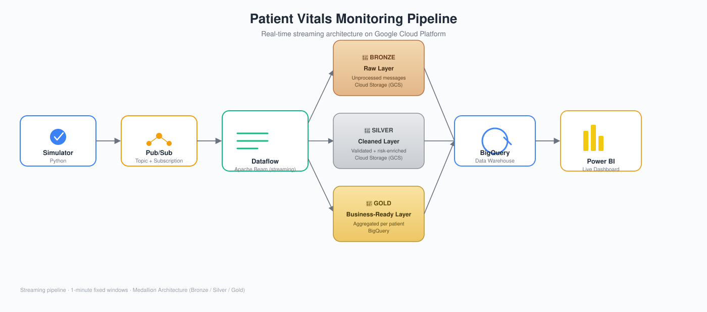
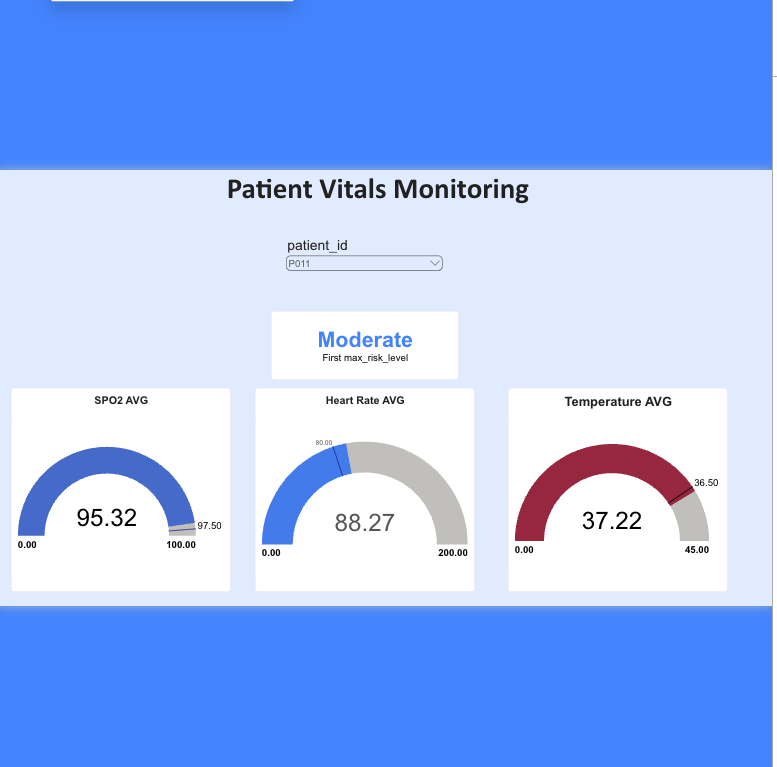

# Patient Vitals Monitoring System

A real-time healthcare data engineering pipeline on Google Cloud Platform — synthetic patient vitals stream through Pub/Sub, get validated and enriched in-flight by a Dataflow (Apache Beam) pipeline following the Medallion Architecture, land in BigQuery, and surface in a live Power BI dashboard. Built solo, end to end: infrastructure, pipeline code, IAM, and visualization.

---

## The problem

Continuous patient vitals — heart rate, SpO2, temperature, blood pressure — are exactly the kind of data where a batch pipeline running once an hour isn't good enough: an abnormal reading is only useful if it surfaces close to when it happened. This project builds the streaming infrastructure to do that: ingest vitals as they arrive, validate and score risk in real time, and keep a dashboard current without manual refreshes.

## Features

| Component | What it actually does |
|---|---|
| **Vitals Simulator** | Python script publishing synthetic patient vitals (heart rate, SpO2, temperature, blood pressure) to Pub/Sub every few seconds, with a configurable error-injection rate (missing fields, out-of-range values) to exercise the validation logic downstream. |
| **Streaming Pipeline** | Apache Beam pipeline on Dataflow, reading from a Pub/Sub subscription in 60-second fixed windows, running continuously (not a scheduled batch job). |
| **Bronze Layer** | Raw, unmodified messages written to GCS — the system of record for what was actually received, before any filtering. |
| **Data Quality Gate** | Every message is checked against 12 documented rules (completeness, validity, consistency, timeliness) defined in one file, [`dataflow/quality_rules.py`](./dataflow/quality_rules.py). |
| **Quarantine** | Records that fail a rule are written to GCS with the original message and every failure reason, instead of being dropped silently. |
| **Silver Layer** | Records that passed the quality gate, enriched with a computed risk score and risk level, written as JSON lines. |
| **Gold Layer** | Silver records aggregated per patient per window (average vitals, worst risk level observed) and written to BigQuery. |
| **Power BI Dashboard** | Live/near-real-time visuals over the Gold table — risk distribution, per-patient vitals, and top-line KPIs. |

## What's real infrastructure here, and what isn't

Being direct about this, since it's a portfolio/learning project and the data is synthetic — worth being upfront rather than letting the dashboard imply otherwise:

- **Real, working infrastructure**: Pub/Sub ingestion, a genuine Dataflow streaming job (not DirectRunner/local), GCS-based Bronze/Silver layering, BigQuery aggregation, and a live Power BI connection — all of this runs exactly as it would against real IoT devices.
- **Synthetic data**: patient vitals are randomly generated within plausible physiological ranges, not sourced from real monitoring hardware or real patients.
- **Rule-based, not ML**: risk scoring (`risk_score` / `risk_level`) is a hand-weighted formula over heart rate, temperature, and SpO2 deviation — not a trained model. It's deterministic and documented inline in the pipeline code, not a black box.

## Risk scoring methodology

`risk_score` is a weighted sum: 40% heart-rate deviation from a 200bpm ceiling, 30% temperature deviation from a 40°C ceiling, 30% SpO2 deficit from 100%. That score buckets into **Low** (< 0.3), **Moderate** (0.3–0.6), or **High** (≥ 0.6) per record, and the Gold layer keeps the *worst* risk level seen for each patient within a window.

This is a reasonable first-pass heuristic, not a clinically validated triage score — swapping in a real scoring model (or clinician-defined thresholds) would be a drop-in replacement at the `enrich_record` step without touching the rest of the pipeline.

## Data governance

Full field definitions, sensitivity classification, and ownership roles are in the [data dictionary](./docs/data_dictionary.md).

### Data quality rules

The pipeline originally used one filter function that dropped bad records without saying why or how many. That filter also never checked `timestamp` or blood pressure, so some bad records reached Silver. It is now a rule set where each rule has an ID, a data quality dimension, and a severity:

| Dimension | Rules | What they catch |
|---|---|---|
| Completeness | DQ-01 | Missing or null required fields |
| Validity | DQ-00, DQ-02 to DQ-09 | Unparseable messages, non-numeric vitals, bad patient ID or timestamp format, out-of-range vitals |
| Consistency | DQ-10 | Systolic pressure not above diastolic |
| Timeliness | DQ-11, DQ-12 | Timestamps in the future (quarantined) or older than 24 hours (flagged, kept) |

The ranges catch data errors such as sensor faults and malformed payloads, not clinical alerts. Clinically abnormal but real readings still reach risk scoring.

### Results

Measured on 10,000 simulated records with the simulator's default 10% error rate (`python tools/data_quality_report.py --records 10000 --seed 42`):

| | Original filter | Quality rules |
|---|---|---|
| Injected errors that reached Silver | 47 of 1,036 (4.5%), all missing timestamps | 0 of 1,036 |
| Clean records wrongly rejected | 0 | 0 |

The simulator only injects three kinds of error (missing field, negative heart rate, SpO2 of 150). The other rules are covered by unit tests in [`tests/`](./tests/).

### Monitoring

The quality gate publishes Beam counters under the `data_quality` namespace (`records_in`, `records_valid`, `records_quarantined`, and `failed_DQ-xx` per rule). They appear under the job's custom counters in the Dataflow console, so a spike in one rule is visible without querying the data.

### Sensitive data handling

The data is synthetic, but the pipeline is designed as if it carried PHI. `patient_id`, `timestamp`, and the vital signs are classified as PHI, and the computed risk fields as derived PHI (see the data dictionary).

**In place now:**
- Quarantined records stay in the same controlled bucket as Bronze and Silver, not in logs or email alerts.
- The Dataflow worker runs as a service account with specific roles (listed under Setup) instead of personal credentials.
- Data at rest in GCS and BigQuery is encrypted by default by Google Cloud.

**Needed before this could carry real PHI:**
- A Business Associate Agreement (BAA) with Google Cloud, and confirmation that every service used is covered by it.
- IAM roles scoped to the specific buckets and dataset rather than the whole project, with separate access for Bronze/Quarantine (raw PHI) and Gold (analytics).
- BigQuery column-level security (policy tags) on `patient_id`, and row-level security so care teams only see their own patients.
- Tokenizing `patient_id` before the Gold layer (for example with Sensitive Data Protection), so the dashboard never shows a real identifier.
- Data Access audit logs turned on, so every read of PHI is recorded.
- Retention rules: GCS lifecycle policies on Bronze and Quarantine, and table or partition expiration in BigQuery, set by the data owner's retention policy.

## Tech stack

- **Ingestion:** Google Cloud Pub/Sub
- **Stream processing:** Apache Beam on Google Cloud Dataflow
- **Storage (Bronze/Silver):** Google Cloud Storage
- **Storage (Gold):** Google BigQuery
- **Visualization:** Power BI
- **Data quality:** rule-based checks in Apache Beam, pytest
- **Language:** Python
- **Infra & Auth:** GCP IAM, Cloud Shell

## Architecture



```
Simulator (Python)
    └── publishes JSON → Pub/Sub Topic
                            └── Pub/Sub Subscription
                                  └── Dataflow (Apache Beam, streaming)
                                        ├── Bronze  → GCS (raw)
                                        ├── Quality gate (12 rules)
                                        │     └── failed → GCS quarantine (with reasons)
                                        ├── Silver  → GCS (validated + risk-enriched)
                                        └── Gold    → BigQuery (aggregated per patient)
                                                          └── Power BI (live dashboard)
```

## Setup

```bash
git clone https://github.com/OmkarK23/patient-Vital-Monitoring.git
cd patient-Vital-Monitoring
```

Each subfolder (`simulator/`, `dataflow/`) expects its own `.env` — not committed, see `.gitignore`:

**`simulator/.env`**
```
GCP_PROJECT=your-project-id
PUBSUB_TOPIC=patient_vitals_stream
PATIENT_COUNT=20
STREAM_INTERVAL=2
ERROR_RATE=0.1
```

**`dataflow/.env`**
```
GCP_PROJECT=your-project-id
PUBSUB_SUBSCRIPTION=projects/your-project-id/subscriptions/patient_vitals_stream-sub
BRONZE_PATH=gs://your-bucket/bronze/
SILVER_PATH=gs://your-bucket/silver/
QUARANTINE_PATH=gs://your-bucket/quarantine/   # optional, this is the default
BIGQUERY_TABLE=your-project-id.healthcare.patient_risk_analytics
TEMP_LOCATION=gs://your-bucket/temp/
STAGING_LOCATION=gs://your-bucket/staging/
REGION=us-east1
```

Requires the Dataflow worker service account (`PROJECT_NUMBER-compute@developer.gserviceaccount.com`) to have `roles/dataflow.worker`, `roles/pubsub.subscriber`, `roles/storage.objectAdmin`, `roles/bigquery.dataEditor`, and `roles/bigquery.jobUser`.

### Run

```bash
# Terminal 1 — start publishing synthetic vitals
cd simulator
python patient_vitals_simulator.py

# Terminal 2 — start the streaming pipeline
cd dataflow
python streaming_medallion_pipeline.py
```

`dataflow/setup.py` ships `quality_rules.py` to the Dataflow workers, so run the pipeline from the `dataflow/` folder as shown.

### Test the data quality rules locally

No GCP account needed:

```bash
pip install -r requirements-dev.txt
python -m pytest tests
python tools/data_quality_report.py --records 10000 --seed 42
```

The pipeline runs as a continuous streaming Dataflow job — monitor it in the [GCP Console](https://console.cloud.google.com/dataflow) and cancel it when done, since streaming jobs bill by the hour until stopped.

## Dashboard



The `.pbix` file (`Patient_Vital_Monitoring.pbix`) is also included in this repo — download it and open in Power BI Desktop to explore the underlying model and queries directly.

## Known limitations

- Vitals are synthetic, generated within plausible ranges rather than sourced from real monitoring hardware.
- Risk scoring is a hand-weighted heuristic, not a clinically validated model.
- No timestamp is currently carried through to the Gold table, so the dashboard shows current aggregates rather than a true time series.
- Dataflow's local Prism-based `DirectRunner` doesn't yet support the native Pub/Sub read transform — this pipeline is built to run on managed Dataflow (`DataflowRunner`), not locally.

## Future improvements

- Carry a window-end timestamp into the Gold table to enable time-series risk trending
- Replace the hand-weighted risk formula with a trained or clinically-defined scoring model
- Alerting (Pub/Sub → Cloud Function → notification) when a patient crosses into High risk
- Terraform for the IAM roles and bucket/dataset setup, instead of manual `gcloud` commands

## Author

Omkar Kalekar